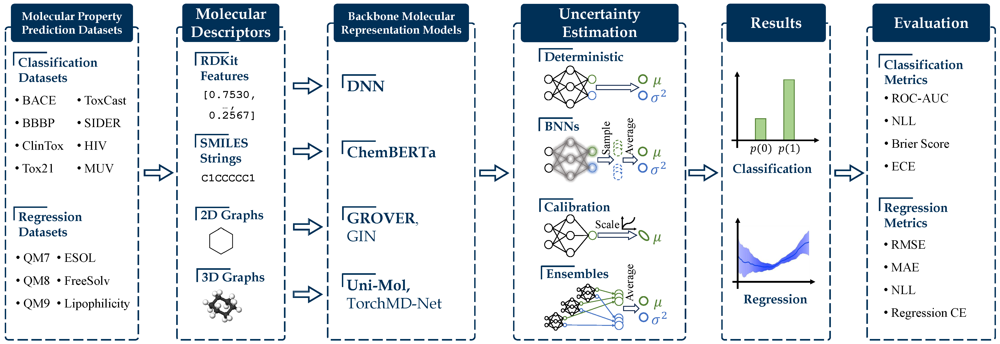

# MUBen: **M**olecular **U**ncertainty **Ben**mark
Code associated with paper *MUBen: **Ben**chmarking the **U**ncertainty of **M**olecular Representation Models*.

[](https://yinghao-li.github.io/MUBen/)
[](https://openreview.net/forum?id=qYceFeHgm4)
[](https://arxiv.org/abs/2306.10060)
[](https://github.com/Yinghao-Li/MUBen/)
[](https://badge.fury.io/py/muben)

Please visit [📕 Documentation](https://yinghao-li.github.io/MUBen/) for the full documentation of this project, which contains more comprehensive API introductions and examples.




MUBen is a benchmark that aims to investigate the performance of uncertainty quantification (UQ) methods built upon backbone molecular representation models.
It implements 6 backbone models (4 pre-trained and 2 non-pre-trained), 8 UQ methods (8 compatible for classification and 6 for regression), and 14 datasets from [MoleculeNet](https://moleculenet.org/) (8 for classification and 6 for regression).
We are actively expanding the benchmark to include more backbones, UQ methods, and datasets.
This is an arduous task, and we welcome contribution or collaboration in any form.

## Backbones

| Backbone Models      | Paper | Official Repo |
| ----------- | ----------- | ----------- |
|***Pre-Trained*** |||
| ChemBERTa |[link](https://arxiv.org/abs/2209.01712) | [link](https://github.com/seyonechithrananda/bert-loves-chemistry) | 
| GROVER   | [link](https://arxiv.org/abs/2007.02835) | [link](https://github.com/tencent-ailab/grover)|
|Uni-Mol| [link](https://openreview.net/forum?id=6K2RM6wVqKu) | [link](https://github.com/dptech-corp/Uni-Mol/tree/main/unimol) |
|TorchMD-NET | [Architecture](https://arxiv.org/abs/2202.02541); [Pre-training](https://arxiv.org/abs/2206.00133) | [link](https://github.com/shehzaidi/pre-training-via-denoising) |
| ***Trained from Scratch*** |||
|DNN|-|-|
|GIN| [link](https://arxiv.org/pdf/1810.00826.pdf) | [pyg](https://pytorch-geometric.readthedocs.io/en/latest/generated/torch_geometric.nn.models.GIN.html) |


## Uncertainty Quantification Methods
| UQ Method | Classification | Regression | Paper |
| ----------- | ----------- | ----------- | ----------- |
| ***Included in Paper*** |||
| Deterministic | ✅︎ | ✅︎ | - |
| Temperature Scaling | ✅︎ | - | [link](https://arxiv.org/abs/1706.04599) |
| Focal Loss | ✅︎ | - | [link](https://arxiv.org/abs/1708.02002) |
| Deep Ensembles | ✅︎ | ✅︎ | [link](https://arxiv.org/abs/1612.01474) |
| SWAG | ✅︎ | ✅︎ | [link](https://arxiv.org/abs/1808.05326) |
| Bayes by Backprop | ✅︎ | ✅︎ | [link](https://arxiv.org/abs/1505.05424) |
| SGLD | ✅︎ | ✅︎ | [link](https://www.stats.ox.ac.uk/~teh/research/compstats/WelTeh2011a.pdf) |
| MC Dropout | ✅︎ | ✅︎ | [link](https://arxiv.org/abs/1506.02142) |
| ***Additional in Repo*** |||
| Evidential Networks |✅︎|✅︎|[link](https://openreview.net/forum?id=xqS8k9E75c)|
| Conformal Prediction |-|✅︎| [link](https://arxiv.org/abs/2107.07511) |
| Isotonic Calibration| - | ✅︎ | [link](https://arxiv.org/abs/1905.06023)|

## Data

> The prepared scaffold-split data is available in the [./data/files/](https://github.com/Yinghao-Li/UncertaintyBenchmark/tree/main/data/files) directory.

This documentation utilizes a selection from the MoleculeNet benchmark, which includes datasets such as BBBP, Tox21, ToxCast, SIDER, ClinTox, BACE, MUV, HIV, ESOL, FreeSolv, Lipophilicity, QM7, QM8, and QM9.
For detailed descriptions of these datasets, please refer to the [MoleculeNet website](https://moleculenet.org/datasets-1).

We employ the "molecular property" datasets curated by [Uni-Mol](https://github.com/dptech-corp/Uni-Mol/tree/main/unimol), which are accessible for download [here](https://bioos-hermite-beijing.tos-cn-beijing.volces.com/unimol_data/finetune/molecular_property_prediction.tar.gz).
While the original Uni-Mol dataset is generally not necessary, it is used to provide pre-defined molecule conformations for running the Uni-Mol model.
To use the Uni-Mol data, download and unzip the files into the `./data/UniMol/` directory.
For ease of reference, you are suggested to rename the `qm7dft`, `qm8dft`, and `qm9dft` directories to `qm7`, `qm8`, and `qm9`, respectively.
The conversion of the dataset format from Uni-Mol to our specifications can be viewed in the script [dataset_build_from_unimol.py](https://github.com/Yinghao-Li/MUBen/blob/main/assist/dataset_build_from_unimol.py).

Typically, each dataset comprises 4 files: `train.csv`, `valid.csv`, `test.csv`, and `meta.json`.
The `.csv` files partition the data into training, validation, and testing sets, while `meta.json` contains metadata such as task type (classification or regression), number of tasks, and number of classes (for classification tasks).
Each `.csv` file contains three columns:
- `smiles`: A string representing the SMILES notation of a molecule.
- `labels`: A list of integers or floats representing the property values to be predicted for each molecule. The length of the list corresponds to the number of tasks.
- `masks`: A binary list (containing 0s and 1s) where 1 indicates a valid property value and 0 indicates an invalid value to be ignored during training and testing.

The dataset is automatically loaded during training through the method `muben.dataset.Dataset.prepare()`.
For a practical example, visit the [example](./train.python.md) page.

## Environment Setup

Our code is developed with `Python 3.10`, and does **not** work with `Python < 3.9`.

### Installation

MUBen is available as a Python package on [PyPI](https://pypi.org/project/muben/) and can be installed using pip.
If you prefer to use MUBen as a standalone package and do not need to modify the source code, you can simply run:
```bash
pip install muben
```

To download the source code and datasets, you can fork the project on GitHub and clone your fork, or directly clone the original repository:

```bash
# Clone your fork of the repository
git clone https://github.com/<your GitHub username>/MUBen.git

# Or clone the original repository with git
git clone https://github.com/Yinghao-Li/MUBen.git --single-branch --branch main
```


### Anaconda

Suppose you have anaconda or miniconda installed in your local machine, you can create a new `conda` environment for this project using `conda create`.
```bash
conda create -n muben python=3.10
```

The required packages are listed in `requirements.txt`.
It is recommended to install these dependencies with `pip install` as `conda install` may sometimes encounter dependency resolution issue.
```bash
conda activate muben
pip install -r requirements.txt
```

### Backbone Checkpoints

Some backbone models require loading pre-trained model checkpoints.

- For ChemBERTa, we use the `DeepChem/ChemBERTa-77M-MLM` checkpoint hosted on Hugging Face's [Model Hub](https://huggingface.co/models). You can specify the model name to the argument `--pretrained_model_name_or_path` (which is set to default), or you can download the model and pass the path to the model to the argument.
- The `GROVER-base` checkpoint is available at GROVER's [project repo](https://github.com/tencent-ailab/grover) or can be directly downloaded through [this link](https://ai.tencent.com/ailab/ml/ml-data/grover-models/pretrain/grover_base.tar.gz).
Unzip the downloaded `.tar.gz` file to get the `.pt` checkpoint.
- The `Uni-Mol` checkpoint is available at Uni-Mol's [project repo](https://github.com/dptech-corp/Uni-Mol/tree/main/unimol) or can be directly downloaded through [this link](https://github.com/dptech-corp/Uni-Mol/releases/download/v0.1/mol_pre_no_h_220816.pt).
- The `TorchMD-NET` checkpoint is available at this [project repo](https://github.com/shehzaidi/pre-training-via-denoising) or can be directly downloaded through [this link](https://github.com/shehzaidi/pre-training-via-denoising/raw/main/checkpoints/denoised-pcqm4mv2.ckpt).


## Fine-Tuning the Models

> Please visit [this Documentation page](https://yinghao-li.github.io/MUBen/train.python/) for a guideline of using the `muben` package, or [this Documentation page](https://yinghao-li.github.io/MUBen/customize/) for an instruction about incorporating customized datasets or backbone models.

The [./run/](https://github.com/Yinghao-Li/MUBen/tree/main/run) directory contains the entry scripts to fine-tuning each of the backbone-UQ combinations.
Currently, the script [./run/run.py](https://github.com/Yinghao-Li/MUBen/blob/main/run/run.py) is adopted to run all backbone models except for GROVER and Uni-Mol, whose entry scripts are [./run/grover.py](https://github.com/Yinghao-Li/MUBen/blob/main/run/grover.py) and [./run/unimol.py](https://github.com/Yinghao-Li/MUBen/blob/main/run/unimol.py), respectively.

### Specify Arguments Using Command Lines

An example of running the **DNN** model with **RDKit** features with the **MC Dropout** UQ method on the **BBBP** dataset is
```bash
CUDA_VISIBLE_DEVICES=0 \
PYTHONPATH="." \
python ./run/run.py \
    --descriptor_type "RDKit" \
    --data_folder "./data/files" \
    --dataset_name "bbbp" \
    --uncertainty_method "MCDropout" \
    --lr 0.0001 \
    --n_epochs 200 \
    --batch_size 256 \
    --seed 0
```
In the example, the `--descriptor_type` argument is used to select the backbone models used in our experiments.
It has 4 options: {"RDKit", "Linear", "2D", "3D"}, which corresponds to the DNN, ChemBERTa, GIN and TorchMD-NET backbone models in the CLI, respectively.
In the future versions, we may consider including multiple backbone models that correspond to one descriptor, which requires us to specify the `--model_name` argument to separate the backbones.
But currently, we do not need to worry about that and can leave `--model_name` as default.

> For the interpretation of each argument, please check the [`muben.args` API](./muben.args.md) or directly refer to the [code implementation](https://github.com/Yinghao-Li/MUBen/tree/main/muben/args).
> Notice that the API documentation may not be entirely comprehensive.

To run GROVER or Uni-Mol, we just need to replace `run.py` by the corresponding script, and slightly modify the arguments:
```bash
CUDA_VISIBLE_DEVICES=0 \
PYTHONPATH="." \
python ./run/unimol.py \
    --data_folder "./data/files" \
    --unimol_feature_folder "./data/UniMol/" \
    --dataset_name "esol" \
    --checkpoint_path "./models/unimol_base.pt" \
    --uncertainty_method "MCDropout" \
    --regression_with_variance \
    ...
```
> For regression tasks, the argument `--regression_with_variance` is vital to guarantee a valid result with predicted variance.

### Specify Arguments using `.yaml` Files

Another way of specifying arguments is through the `.yaml` scripts, which provides more readable data structure than `.json` files.
We have provided an [example configuration script](https://github.com/Yinghao-Li/MUBen/blob/main/scripts/config-example.yaml) within the [./scripts/](https://github.com/Yinghao-Li/MUBen/tree/main/scripts) directory, which runs GIN on the FreeSolv dataset with deterministic ("none") UQ method.
To use it to specify arguments, we can run the python program with
```bash
PYTHONPATH="." CUDA_VISIBLE_DEVICES=0 python ./run/run.py ./scripts/config-example.yaml
```
This approach could be helpful while debugging the code on VSCode.

## Calculating Metrics

During training, we only calculate metrics necessary for early stopping and simple prediction performance evaluation.
To get other metrics, you need to use the `./assist/results_get_metrics.py` file.

After training, the results are saved as `./<result_folder>/<dataset_name>/<model_name>/<uncertainty_method>/seed-<seed>/preds/<test_idx>.pt` files.
You can run the `./assist/results_get_metrics.py` file to generate all metrics for your model predictions.
For example:
```bash
PYTHONPATH="." python ./assist/results_get_metrics.py [arguments]
```
Make sure the arguments are updated to your needs.


## Experimental Results

We have made our experimental results available in the [./reports/](https://github.com/Yinghao-Li/MUBen/tree/main/reports) directory.
These results are organized into different folders based on the nature of the experiments:

- `primary`: Contains the most comprehensive set of results derived from experiments on scaffold-split datasets.
- `random`: Includes results from experiments conducted on datasets that were split randomly.
- `frozen`: Features results from experiments where the pre-trained model's weights were frozen, except for the last output layer, which was updatable.
- `distribution`: Offers results from the QM9 dataset, where the test set was categorized into five bins based on the average Tanimoto similarities to the training scaffolds.

Files within these directories are named following the pattern `<backbone>-<dataset>.csv`.
Each file provides a comparison of different UQ methods.
The rows detail the performance of each UQ method, while the columns display the mean and standard deviation from three random runs for each metric.

Additional post-processing scripts can be found in the [./assist/](https://github.com/Yinghao-Li/MUBen/tree/main/assist) directory, which include files starting with `plot_` or `results_`.
These scripts are useful for further analysis and visualization of the experimental data.

## Citation

If you find our work helpful, please consider citing it as
```latex
@misc{li2023muben,
    title={MUBen: Benchmarking the Uncertainty of Pre-Trained Models for Molecular Property Prediction},
    author={Yinghao Li and Lingkai Kong and Yuanqi Du and Yue Yu and Yuchen Zhuang and Wenhao Mu and Chao Zhang},
    year={2023},
    eprint={2306.10060},
    archivePrefix={arXiv},
    primaryClass={physics.chem-ph}
}
```
